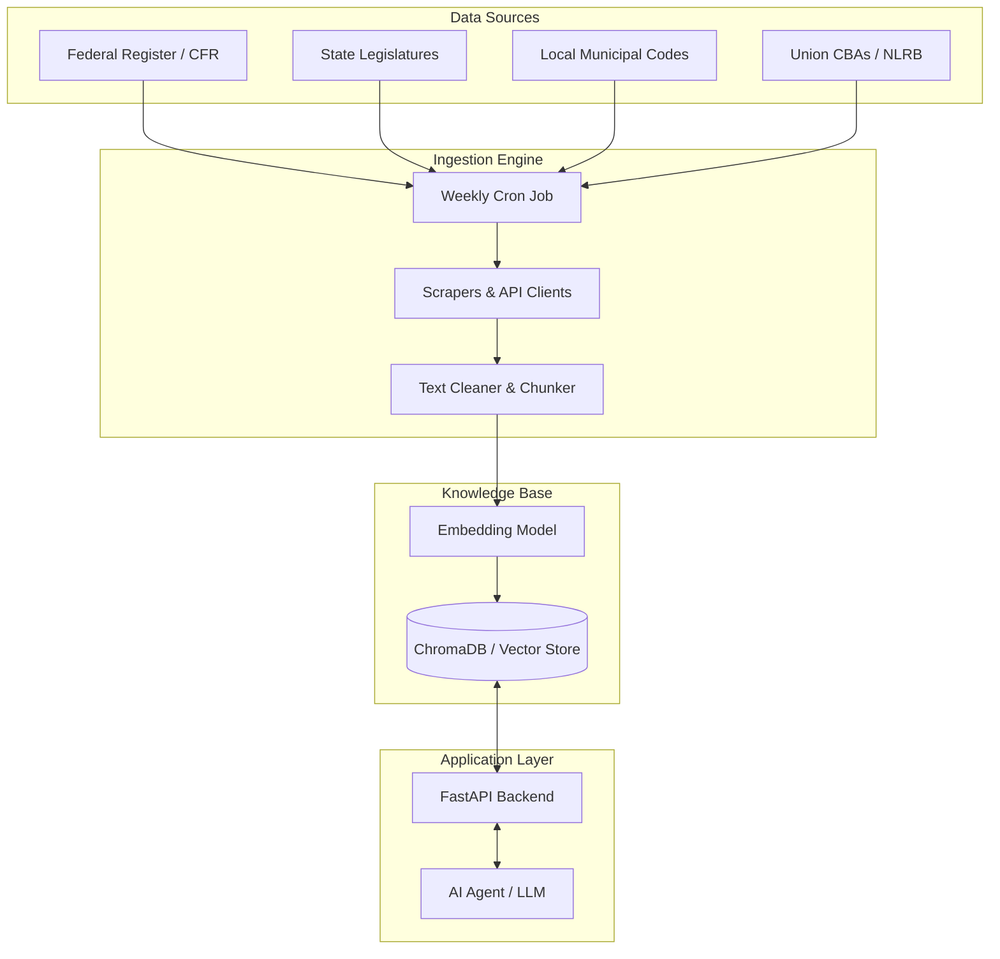

# RetailRegs-RAG: Automated Retail Compliance Monitoring System

## 📋 Overview
**RetailRegs-RAG** is an automated pipeline designed to aggregate, process, and serve US labor laws and retail regulations. The system scrapes regulatory changes weekly from Federal, State, and Local sources, processes them into a vector database (RAG), and exposes them via an API for AI agents.

**Mission:** To provide a single source of truth for retail compliance, specifically targeting fines, worker rights (breaks, safety, environment), and union regulations.

---

## 🏗 Architecture



---

## 🛠 Tech Stack
* **Language:** Python 3.10+
* **Orchestration:** Docker & Docker Compose
* **API Framework:** FastAPI
* **Vector Database:** ChromaDB (Self-hosted, open source)
* **Scraping:** BeautifulSoup4, Selenium, `requests`
* **RAG/LLM Framework:** LangChain or LlamaIndex
* **Embeddings:** `all-MiniLM-L6-v2` (HuggingFace) — *Fast and free*

---

## 📡 Data Sources Strategy
*Note: "Free" sources are prioritized. Complete coverage of every US county is impossible without paid enterprise APIs; this system uses a tiered approach.*

### Level 1: Federal (High Reliability)
* **Source:** [GovInfo API](https://api.govinfo.gov/docs) & [Federal Register API](https://www.federalregister.gov/reader-aids/developer-resources).
* **Targets:**
    * **OSHA (29 CFR):** Workplace safety, lighting, hazardous materials.
    * **DOL / FLSA (29 CFR):** Wages, overtime, break times.
    * **EEOC:** Discrimination and harassment.

### Level 2: State (Medium Reliability)
* **Source:** [Open States API](https://openstates.org/api/) (Free tier available) or direct scraping of State Legislature sites.
* **Targets:** Focus on states with strict retail laws first (CA, NY, IL, WA).
* **Key Search Terms:** "Retail Schedule", "Meal Break", "Predictive Scheduling", "PAGA" (CA).

### Level 3: Unions (Niche)
* **Source:** [DOL Office of Labor-Management Standards (OLMS)](https://www.dol.gov/agencies/olms/regs/compliance/cba).
* **Targets:** Publicly filed **Collective Bargaining Agreements (CBAs)**.
* **Action:** Scrape the "Online Public Disclosure Room" for retail sector agreements (e.g., UFCW).

### Level 4: Local/City (High Difficulty)
* **Source:** Municipal Code Libraries (e.g., Municode, American Legal Publishing).
* **Strategy:** Do **not** try to scrape all 3,000+ counties. Build a scraper for the "Big 10" retail metros (NYC, LA, Chicago, SF, Seattle) first.
* **Targets:** "Fair Workweek" ordinances.

---

## 🚀 Quick Start for Developers

### 1. Clone & Setup
```bash
git clone [https://github.com/your-org/retail-regs-rag.git](https://github.com/your-org/retail-regs-rag.git)
cd retail-regs-rag
cp .env.example .env
```

### 2. Run with Docker (Recommended)
This spins up the API, the ChromaDB instance, and the ingestion worker.
```bash
docker-compose up --build -d
```

### 3. Manual Ingestion (First Run)
Trigger the scrapers manually to seed the database.
```bash
docker-compose exec worker python src/ingest_pipeline.py --mode=full
```

### 4. Query the API
```bash
curl -X POST "http://localhost:8000/query" \
     -H "Content-Type: application/json" \
     -d '{"question": "What are the mandatory break requirements for retail shifts over 6 hours in California?"}'
```

---

## 📂 Project Structure

```text
├── docker-compose.yml       # Orchestrates API, DB, and Worker
├── src/
│   ├── api/                 # FastAPI endpoints
│   ├── core/                # Config and shared utils
│   ├── database/            # ChromaDB connection & schema
│   ├── ingestion/           # The Scraping Logic
│   │   ├── federal/         # GovInfo API client
│   │   ├── state/           # State scrapers
│   │   └── local/           # Municipal code scrapers
│   └── processing/          # Text chunking & Embedding logic
└── requirements.txt
```

---

## 🧠 Development Roadmap

### Phase 1: MVP (The "Brother's Requirement")
* [ ] Implement **Federal Scraper** (OSHA + FLSA).
* [ ] Implement **State Scraper** for **California & New York** only (High fine risk).
* [ ] Set up ChromaDB with basic semantic search.
* [ ] Simple API endpoint for the AI tool.

### Phase 2: Enhanced Intelligence
* [ ] Add **Metadata Filtering** (e.g., `filter={'jurisdiction': 'California'}`).
* [ ] Implement **"Diffing"**: Only alert on *new* or *changed* laws compared to last week.
* [ ] Add **Union CBA scraping** from DOL OLMS.

### Phase 3: Production Scale
* [ ] Add specific scrapers for "Fair Workweek" cities (Seattle, SF, NYC).
* [ ] Dashboard for viewing ingestion logs and failed scrapes.

---

## ⚠️ Key Challenges & Heuristics
1.  **Hallucination Risk:** The AI must cite sources. The RAG system handles this by returning the `source_url` with every code snippet.
2.  **Scraping Blocks:** Government sites are old and slow. Set `sleep` intervals between requests to avoid IP bans.
3.  **Data Rot:** Laws change. The `ingest_pipeline.py` is configured to run weekly (via Celery beat or Cron) to upsert new documents and archive old ones.

## 🤝 Contribution Guidelines
* **Scrapers:** When adding a new state, inherit from the `BaseScraper` class in `src/ingestion/base.py`.
* **Testing:** Run `pytest` before pushing. Mock external API calls.
